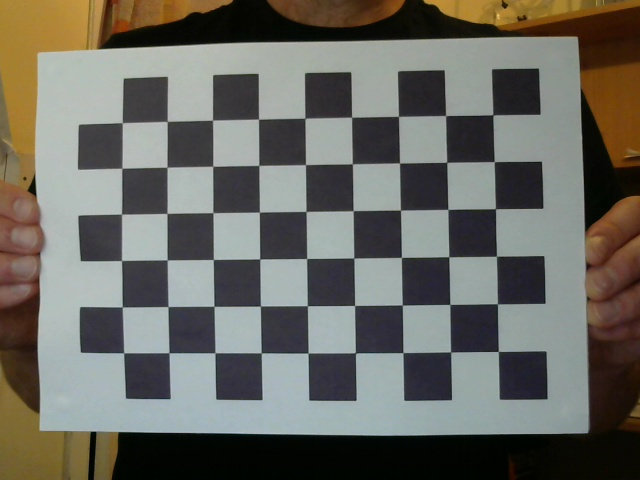

# GridDetector.jl
Detect grids in Julia

#### Checkerboard Detection using GridDetector.jl
```
using Images
using GridDetector

img = Gray.(load("assets/test.jpg"))
res = process_image(img)
draw_rect(img, res,  Gray(1))
save("results.png", img)
```

##### Results:
| Input image     | Output Image |
| ----------- | ----------- |
|  |  |