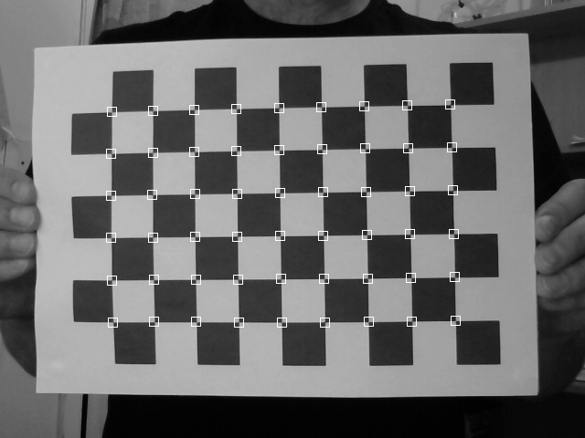

```@meta
CurrentModule = GridDetector
```

# GridDetector.jl

GridDetector.jl provides grid detection algorithms in Julia. 

#### Checkerboard Detection using GridDetector.jl
```
using Images
using GridDetector

img = Gray.(load("assets/test.jpg"))
res = process_image(img)
draw_rect(img, res,  Gray(1))
save("results.png", img)
```

##### Results:
| Input image     | Output Image |
| ----------- | ----------- |
|  |  |

```@autodocs
Modules = [GridDetector]
```